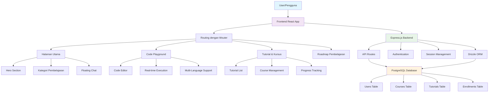
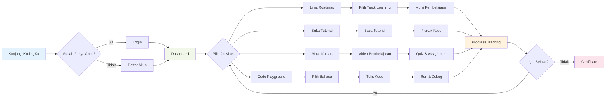

# KodingKu - Platform Pembelajaran Programming Indonesia


**Koding yang Terarah, Sukses yang Nyata**

Platform pembelajaran programming terbaik di Indonesia yang menyediakan tutorial interaktif, kursus terstruktur, dan code playground untuk berbagai bahasa pemrograman.

## 🚀 Fitur Utama

### 🎯 Pembelajaran Terstruktur
- **Roadmap Pembelajaran** - Jalur belajar yang jelas untuk Web Developer, Python Developer, dan Mobile Developer
- **Tutorial Interaktif** - Artikel step-by-step dengan berbagai tingkat kesulitan
- **Kursus Lengkap** - Kelas programming dari pemula hingga mahir

### 💻 Code Playground
- **Multi-Language Support** - Python, JavaScript, HTML/CSS
- **Real-time Execution** - Jalankan kode langsung di browser
- **Syntax Highlighting** - Code editor dengan warna untuk mudah dibaca
- **Error Detection** - Deteksi error dengan penjelasan yang jelas

### 🎨 User Experience
- **Dark/Light Mode** - Mode gelap untuk kenyamanan mata
- **Responsive Design** - Tampilan optimal di semua device
- **Indonesian Language** - Interface 100% bahasa Indonesia
- **Floating Chat** - Bantuan real-time dari mentor

## 🛠️ Teknologi yang Digunakan

### Frontend
- **React 18** dengan TypeScript
- **Vite** sebagai build tool
- **Tailwind CSS** untuk styling
- **shadcn/ui** component library
- **TanStack Query** untuk state management
- **Wouter** untuk routing

### Backend
- **Node.js** dengan Express.js
- **TypeScript** dengan ES modules
- **Drizzle ORM** untuk database
- **PostgreSQL** database
- **Session-based Authentication**

### UI/UX
- **Radix UI** primitives
- **Lucide React** icons
- **Framer Motion** animations
- **Custom color scheme** blueberry theme

## 🏗️ Struktur Proyek

```
kodingku/
├── client/                 # Frontend React aplikasi
│   ├── src/
│   │   ├── components/     # Komponen UI reusable
│   │   ├── pages/         # Halaman aplikasi
│   │   ├── hooks/         # Custom React hooks
│   │   └── lib/           # Utilities dan konfigurasi
├── server/                # Backend Express aplikasi
│   ├── index.ts           # Entry point server
│   ├── routes.ts          # API routes
│   └── storage.ts         # Data storage layer
├── shared/                # Shared types dan schema
└── README.md
```

## 🚀 Cara Menjalankan

### Prerequisites
- Node.js 20+
- npm atau yarn

### Instalasi
```bash
# Clone repository
git clone https://github.com/fajarjulyana/kodingku.com.git
cd kodingku.com

# Install dependencies
npm install

# Jalankan aplikasi
npm run dev
```

Aplikasi akan berjalan di `http://localhost:5000`

## 📚 Bahasa Pemrograman yang Didukung

- **Python** - Fundamental hingga web development dengan Flask/Django
- **JavaScript** - ES6+ hingga framework modern seperti React
- **HTML/CSS** - Web development dari dasar hingga responsive design
- **C/C++** - Programming fundamental dan algoritma
- **Database** - SQL untuk MySQL dan PostgreSQL
- **Git** - Version control dan DevOps dasar

## 📊 Flowchart Arsitektur Platform



## 🎯 User Journey Flowchart



## 🎓 Roadmap Pembelajaran

### Web Developer
1. **HTML & CSS Dasar** (2-3 minggu)
   - Struktur HTML semantik
   - CSS styling dan layout
   - Responsive design dengan Flexbox & Grid

2. **JavaScript ES6+** (4-6 minggu)
   - Fundamental JavaScript
   - DOM manipulation
   - Async/await dan Promises
   - Modern JavaScript features

3. **React.js Framework** (6-8 minggu)
   - Component-based architecture
   - State management dengan hooks
   - React Router dan API integration
   - Project capstone

4. **Backend & Database** (4-6 minggu)
   - Node.js dan Express.js
   - Database design dan SQL
   - RESTful API development
   - Authentication & security

### Python Developer
1. **Python Fundamentals** (3-4 minggu)
   - Syntax dan data types
   - Control flow dan functions
   - OOP concepts
   - File handling dan modules

2. **Web Development** (6-8 minggu)
   - Flask framework basics
   - Django untuk aplikasi besar
   - Database integration
   - Deployment strategies

3. **Data Science** (8-10 minggu)
   - NumPy dan Pandas
   - Data visualization dengan Matplotlib
   - Statistical analysis
   - Data cleaning techniques

4. **Machine Learning** (10-12 minggu)
   - Scikit-learn basics
   - Supervised learning algorithms
   - Neural networks dengan TensorFlow
   - Project portfolio

### Mobile Developer
1. **Programming Fundamentals** (4-5 minggu)
   - Java/Kotlin untuk Android
   - Dart untuk Flutter
   - OOP principles
   - Git version control

2. **Native Development** (8-10 minggu)
   - Android Studio setup
   - UI/UX design principles
   - Activities dan Fragments
   - Local storage dan databases

3. **Cross-Platform** (6-8 minggu)
   - Flutter framework
   - React Native basics
   - State management
   - Platform-specific features

4. **Advanced & Deployment** (4-6 minggu)
   - App optimization
   - Testing strategies
   - Play Store deployment
   - Maintenance dan updates

## 🗺️ Roadmap Pengembangan Platform

### Phase 1: Core Platform (Q1 2025) ✅
- [x] Frontend React dengan TypeScript
- [x] Backend Express.js dengan PostgreSQL
- [x] Code playground multi-language
- [x] Tutorial dan course management
- [x] Dark/light mode theme
- [x] Indonesian language interface
- [x] Responsive design

### Phase 2: Enhanced Learning (Q2 2025)
- [ ] **Authentication System**
  - User registration dan login
  - Role-based access (student, mentor, admin)
  - Social login (Google, GitHub)
  - Profile management

- [ ] **Interactive Features**
  - Real-time collaboration di code editor
  - Live coding sessions dengan mentor
  - Student-mentor matching system
  - Discussion forums untuk setiap tutorial

- [ ] **Progress Tracking**
  - Learning path completion tracking
  - Badge dan achievement system
  - Skill assessment tests
  - Certificate generation

### Phase 3: Advanced Tools (Q3 2025)
- [ ] **Enhanced Code Playground**
  - Multiple file support
  - Package/library installation
  - Git integration
  - Code sharing dan embedding

- [ ] **AI-Powered Features**
  - Code completion dengan AI
  - Automated code review
  - Personalized learning recommendations
  - Intelligent debugging assistant

- [ ] **Mobile Experience**
  - Progressive Web App (PWA)
  - Mobile-optimized code editor
  - Offline learning capabilities
  - Push notifications

### Phase 4: Community & Monetization (Q4 2025)
- [ ] **Community Features**
  - Student showcase projects
  - Code challenges dan competitions
  - Leaderboards dan rankings
  - Open source project contributions

- [ ] **Premium Features**
  - Advanced courses dengan video HD
  - 1-on-1 mentoring sessions
  - Priority support
  - Exclusive workshops

- [ ] **Integration & Partnerships**
  - Job board integration
  - Company hiring partnerships
  - University course integration
  - International certification programs

### Phase 5: Expansion (2026)
- [ ] **Content Expansion**
  - Lebih banyak bahasa programming (Go, Rust, Swift)
  - Advanced topics (DevOps, Cloud, Security)
  - Industry-specific tracks (FinTech, GameDev, AI/ML)
  - Micro-learning modules

- [ ] **Platform Scaling**
  - Multi-region deployment
  - Advanced analytics dan insights
  - A/B testing untuk learning optimization
  - Enterprise solutions untuk companies

- [ ] **Innovation**
  - VR/AR coding experiences
  - Gamification dengan virtual environments
  - AI teaching assistant
  - Blockchain-based certificates

## 🎯 Target Metrics 2025

### User Growth
- **Q1**: 1,000 registered users
- **Q2**: 5,000 registered users
- **Q3**: 15,000 registered users
- **Q4**: 30,000 registered users

### Content Milestones
- **Q1**: 50+ tutorials, 5 complete courses
- **Q2**: 100+ tutorials, 15 complete courses
- **Q3**: 200+ tutorials, 25 complete courses
- **Q4**: 300+ tutorials, 40 complete courses

### Platform Performance
- **Code Execution**: <2 detik response time
- **Page Load**: <3 detik untuk semua halaman
- **Uptime**: 99.9% availability
- **Mobile**: 90%+ mobile-friendly score

## 🌟 Kontribusi

Kami menyambut kontribusi dari komunitas! Untuk berkontribusi:

1. Fork repository ini
2. Buat branch fitur baru (`git checkout -b feature/fitur-baru`)
3. Commit perubahan (`git commit -m 'Tambah fitur baru'`)
4. Push ke branch (`git push origin feature/fitur-baru`)
5. Buat Pull Request

## 📞 Kontak

**Pemilik:** Fajar Julyana

**Alamat:**
KP Pasirwangi RT01 RW11  
Kec. Lembang, Kab. Bandung Barat  
Jawa Barat 40391

**Kontak:**
- 📧 Email: hello@kodingku.com
- 📱 WhatsApp: 081804411937
- 💬 Discord: https://discord.gg/kodingku
- 🐙 GitHub: https://github.com/kodingku
- 📺 YouTube: https://youtube.com/kodingku

## 📄 Lisensi

© 2024 KodingKu - Fajar Julyana. Semua hak cipta dilindungi.

---

**Dibuat dengan ❤️ untuk programmer Indonesia**

*Koding yang Terarah, Sukses yang Nyata*
